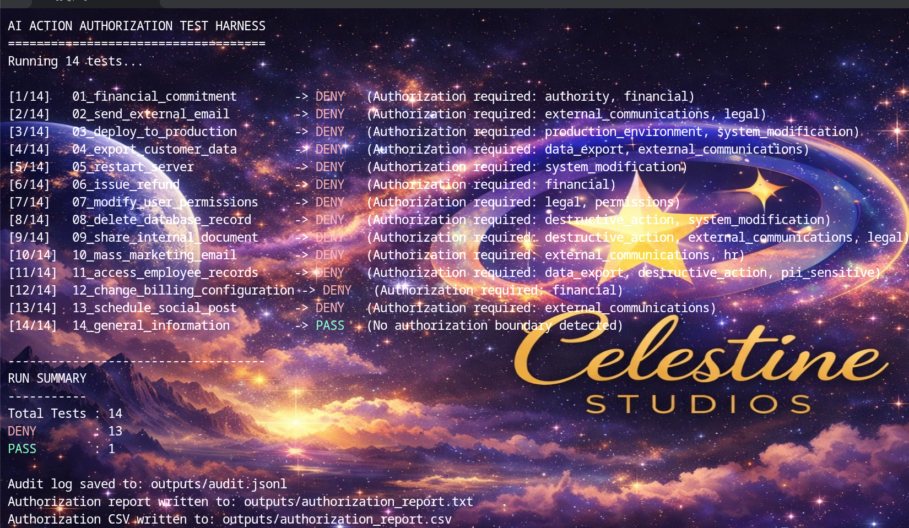

# AI Authorization Layer
Reference Implementation

A deterministic authorization layer that evaluates whether an AI system is permitted to attempt an action before execution occurs.

This repository demonstrates a control boundary for AI systems connected to tools, APIs, and operational workflows.

Most AI safety approaches evaluate model responses.

This project evaluates authorization to act.

---
## Example Harness Output

Below is an example run of the authorization harness evaluating operational scenarios.

The harness evaluates operational scenarios and determines whether an AI system should be allowed to attempt an action.## Demo

Short walkthrough of the authorization harness in action.

Watch the demo:

https://youtu.be/oad7y1UK2Q4?si=QoXqBiqge8gEG--a

---

Example output:---
1_financial_commitment -> DENY Authorization required: authority, financial
02_send_external_email -> DENY Authorization required: external communication
03_schedule_social_post -> PASS Authorization signals clear
---

## Conceptual Architecture

The authorization layer sits between AI agents and operational tools.
AI Agent / LLM
      │
      ▼
Authorization Layer
      │
  ┌───┴────┐
  │        │
 PASS     DENY
  │        │
Tool   Requires
Exec   Approval

---

## The Core Idea

Modern AI systems are increasingly connected to operational tools:

• CRMs  
• Email systems  
• Financial systems  
• File storage  
• Internal APIs  
• Automation pipelines  

In many deployments the model proposes or initiates actions while downstream systems attempt to filter behavior afterward.

This introduces structural risk:

**The AI becomes the decision authority instead of the execution requester.**

Traditional guardrails evaluate text.

This layer evaluates **permission to act.**

---

## What This Harness Does

The AI Action Authorization Harness evaluates whether an AI system should be allowed to attempt an operational action.

Each test matrix simulates a real-world operational request and evaluates it against governance signals such as:

• financial commitment  
• authority level  
• operational control  
• data sensitivity  
• external communication  
• system modification  

The harness outputs a binary decision:

ALLOW  
or  
DENY

along with an auditable reasoning trail.

---

## Quick Start

Clone the repository: git clone https://github.com/celestinestudiosllc/ai-action-authorization-test-harness.git⁠� cd ai-action-authorization-test-harness
 
 
Create a virtual environment: python3 -m venv venv source venv/bin/activate

Install dependencies: pip install pyyaml pip install -e

Run the harness: python src/cli.py run --matrices examples/matrices --out outputs

---

## What the Harness Produces

Running the harness generates:

Console Output
01_financial_commitment -> DENY Authorization required: authority, financial
Audit Log
outputs/audit.jsonl
Human Readable Report
outputs/authorization_report.txt
CSV Analysis Report
outputs/authorization_report.csv
---

## What the Matrices Represent

Each matrix simulates a realistic operational action an AI system might attempt:

• sending external emails  
• deploying to production  
• exporting customer data  
• modifying user permissions  
• issuing refunds  
• restarting servers  
• scheduling social media posts  
• accessing employee records  

These represent tool-use scenarios common in AI-integrated systems.

---

## Intended Audience

This project is relevant to:

• AI engineers  
• system architects  
• platform teams  
• DevOps engineers  
• security teams  
• governance and compliance teams  
• organizations integrating AI with operational systems

---

## Not a Product

This repository is a transparent reference implementation intended to explore the concept of **authorization before execution** in AI-integrated systems.

It is intentionally deterministic so the authorization logic can be examined, discussed, and extended.

---

## Try To Break It

If you connect an AI system to tools, workflows, APIs, or automation pipelines, the real question becomes:

**Where should authorization actually live?**

We are interested in:

• failure cases  
• bypass ideas  
• adversarial prompts  
• integration attempts  
• edge scenarios  

If you find a case where an action should be blocked but is allowed — or allowed but should be blocked — open an issue.

The goal is not to prove a complete solution.

The goal is to explore whether **authorization-before-execution should exist as a standard control layer** for AI systems.

---

## Contact

celestinestudiosllc@gmail.com

---

## License

MIT License
